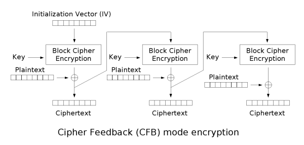

# Java Encrypted P2P Application

A very simple Proof-Of-Concept application, built in Java, that allows the transfer of files within an encrypted P2P network.

## Project Modules and Functionalities

- Server
    - A Central server for registering and authenticating clients.
    - Holds a listing of all files being shares by all clients connects at a present moment in the P2P network.
- Client
  - Connects to the above server providing its own identity and file listing.
  - Clients also run their own respective server to provide other clients a method to fetch files.
- Commons
  - Shared code between the two above.

## Communication Channel

Only Symmetric Encryption is allows in communications.

Two flavours are implemented:
- Using a shared key. 
- Diffie-Hellman Key Agreement. 

Both will end deriving the keys needed for securing the Symmetric Communication Channel.

### Operation Methods

#### CBC - Cipher block chaining

Encryption            |  Decryption
:-------------------------:|:-------------------------:
  | 

#### CFB - Cipher feedback

Encryption            |  Decryption
:-------------------------:|:-------------------------:
  | 

## Certificates and Keys

The following certificate hierarchy was generated:
- Root Certificate (Self signed)
  - Intermediate Certificate (Signed by Root Certificate)
    - Client Certificate (Signed by Intermediate Certificate)
  - Server certificate (Signed by Root Certificate)